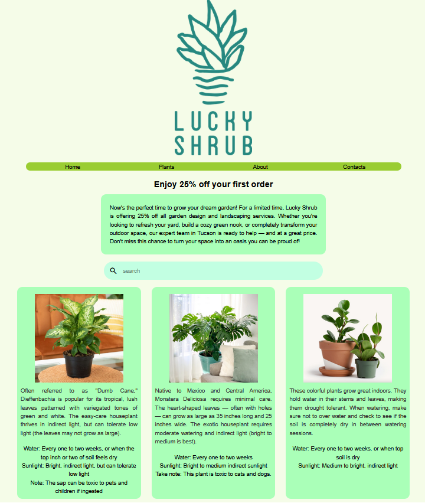
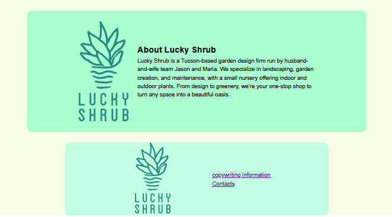

# lucky-shrub-project
This is a project that I developed as part of the Meta Front End Developer Professional Certificate on Coursera (HTML and CSS in depth). The idea was to create a landing page for a fictitious client, in my case, Lucky Shrub, a garden design firm that specializes in landscaping and garden creation.

## Screenshots 

I built this page using only HTML and CSS, using everything I learned throughout the course. The design is clean and simple, with a soft color scheme and attractive images.
In addition, I made sure to apply good accessibility and responsiveness practices, ensuring that the page is easy to navigate on different devices and for everyone.

link to the site:  https://mostafa-al-hassan.github.io/lucky-shrub-project/

